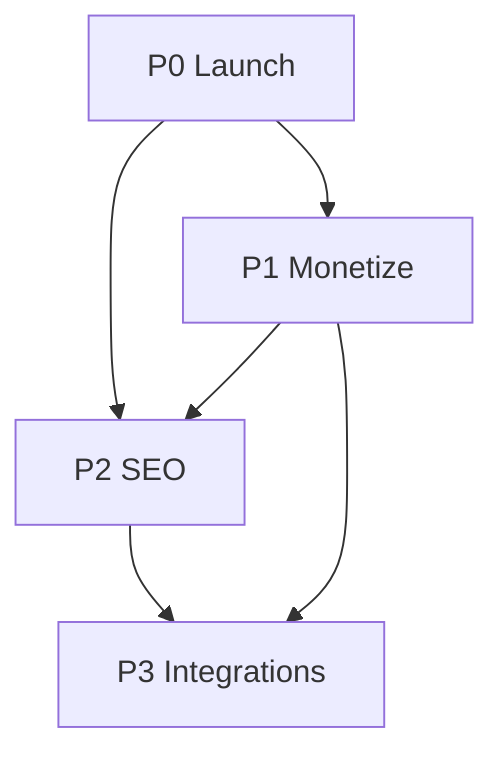

# RemoteForge — Master Plan

**Last updated:** 2026-06-23  
**Product:** India's home for remote jobs and AI gig work  
**Positioning:** Free discovery + India filters + INR pay context + AI gig vertical (vs WWR TopAccess paywall)

---

## Current state (snapshot)

| Area | Status |
|------|--------|
| Monorepo (web + api + packages + worker) | Done |
| Split deploy (Vercel UI + Fly API) | Done |
| Job ingestion (Remotive, WWR RSS, RemoteOK) | Built — verify prod cron |
| AI gig platform seed + comparison UI | Done |
| Web UI refresh (design system, dark mode, skeletons) | Done |
| India badge + salary INR display | Done |
| ForgeAhead / Vettd CTAs on job pages | Partial |
| Affiliate env vars (Turing, Toptal, Outlier) | Config exists — enrollment TBD |
| Company entity + `/companies` pages | Not started |
| Blog / SEO content | Not started |
| Email + WhatsApp digest cron | Built — verify prod |
| Razorpay featured slots | Partial |

---

## Phase overview

```
Phase 0 — Launch ready     [~]  P0-production-launch.md
Phase 1 — Monetize         [ ]  P1-monetization-affiliates.md
Phase 2 — Grow (SEO)       [ ]  P2-companies-and-seo.md
Phase 3 — Ecosystem        [ ]  P3-integrations.md
```

---

## Phase 0 — Launch ready (P0)

**Goal:** Live site with fresh jobs, stable API, working alerts.

| Milestone | Success criteria |
|-----------|------------------|
| M0.1 Deploy | Vercel + Fly + Neon prod; env vars documented in DEPLOY.md |
| M0.2 Ingestion | Cron runs every 6h; job count > 1,000 active |
| M0.3 QA | India filter accurate; apply links resolve; no broken pages |
| M0.4 Observability | Ingest errors logged; basic health check on API |

**Exit:** Homepage stats reflect real DB counts; `/jobs` paginates correctly.

→ Tasks: [P0-production-launch.md](./P0-production-launch.md)

---

## Phase 1 — Monetize (P1)

**Goal:** First affiliate revenue + employer featured slots.

| Milestone | Success criteria |
|-----------|------------------|
| M1.1 P1 affiliates live | Turing + Toptal ref links on senior-role CTAs; Outlier on gig pages |
| M1.2 Click tracking | `/go/[id]` logs UTM + conversions field populated |
| M1.3 Featured slots | Razorpay checkout → `isFeatured` on job; upsell banner visible |
| M1.4 Alerts | Weekly digest sends to subscribers (Resend + optional WhatsApp) |

**Revenue hypothesis (Month 3):** ~₹36k/mo at 500 DAU — see scaffold Part 5.

**Do not build:** WWR TopAccess affiliate CTAs (no public program — scaffold verdict).

→ Tasks: [P1-monetization-affiliates.md](./P1-monetization-affiliates.md)

---

## Phase 2 — Grow / SEO moat (P2)

**Goal:** Organic traffic from India-intent keywords + employer trust pages.

| Milestone | Success criteria |
|-----------|------------------|
| M2.1 Top employers | `/companies` index + `/companies/[slug]` from ingested jobs + WWR bios |
| M2.2 Content | 5+ blog posts (Outlier India guide, RLHF vs annotation, WWR vs free aggregators) |
| M2.3 SEO plumbing | Sitemap, structured data audit, tag/category internal linking |
| M2.4 India UX | “India OK” filter default option; INR-first salary display on cards |

**Data source:** WWR company leaderboard (100 employers, job counts + descriptions) — jobs already flow via RSS; use metadata for pages only.

→ Tasks: [P2-companies-and-seo.md](./P2-companies-and-seo.md)

---

## Phase 3 — Ecosystem (P3)

**Goal:** Closed loop with ForgeAhead + Vettd; shared auth.

| Integration | RemoteForge role |
|-------------|------------------|
| I1 JD deep-link | Job page → ForgeAhead resume scorer (partial — CTA exists) |
| I2 Vettd upsell | Featured employer → Vettd signup (partial) |
| I3 Job feed API | ForgeAhead pulls `/api/jobs` with internal key |
| I4 Skill Proof | Vettd → ForgeAhead webhook (cross-product) |
| I5 Mock interview CTA | ForgeAhead → Vettd practice link |
| I6 Cross-auth | `@intelliforge/cross-auth` handoff tokens (package exists) |

→ Tasks: [P3-integrations.md](./P3-integrations.md)

---

## Dependencies



- **P2 companies** needs stable ingestion (P0) — aggregate from `Job.company`
- **P1 affiliates** can ship in parallel with P0 QA
- **P3** needs prod URLs + shared secrets from P0 deploy

---

## Key decisions (locked)

| Decision | Rationale |
|----------|-----------|
| No WWR TopAccess affiliate | No public publisher program (Jun 2026 intel) |
| Direct Toptal refs only | TopAccess bundle does not credit `AFFILIATE_TOPTAL_REF` |
| WWR/RemoteOK = discovery links | No commission; link to source for apply |
| India wedge | Filters, INR, WhatsApp alerts — competitors lack this |
| Free vs TopAccess | Compete on free discovery, not paid bundles |

---

## Next 2 weeks (recommended focus)

1. **P0:** Confirm prod ingestion cron + job counts vs WWR source
2. **P1:** Enroll Turing + Toptal; wire CTAs on job detail for senior roles
3. **P2:** Scaffold `/companies` from DB aggregation (no schema change v1)
4. **Content:** Draft “How to get approved on Outlier AI from India” (editorial moat)

---

## References

- Architecture + affiliate intel: [`remotejobs-affiliate-engine-scaffold-prompt.md`](../remotejobs-affiliate-engine-scaffold-prompt.md)
- Deploy runbook: [`DEPLOY.md`](../DEPLOY.md)
- WWR employer seed notes: [`data/wwr-top-employers-notes.md`](./data/wwr-top-employers-notes.md)
